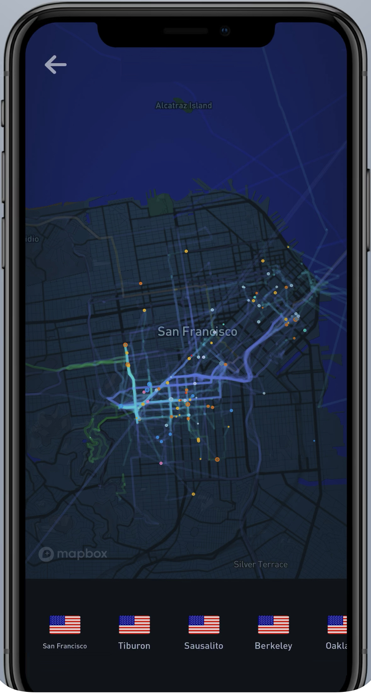

# W1 Thinking Cap

## Screenshot

## Links

[Website](https://gyrosco.pe/)

[iOS App](https://apps.apple.com/us/app/gyroscope/id1104085053)

## Site Agenda

The product is for-profit, so their agenda is to make money. As for what the product does, it helps users improve themselves in various ways such as productivity, mental health (mood, stress), exercise and fitness, etc. using their own data to track and spot trends. Specifically for the map component, it allows you to track your location throughout your life and the different cities, states, and countries you explore. It gets data about what you used to travel, how long you were there for, and how many times you've gone to plot onto the map.

## Why It Speaks to Me

This product speaks to me because I'm someone that loves to track most things about my life to see the history and possible trends, whether that be location, health data, and more. This product allows me to visualize where I've been throughout my life and does it very well, in a visually appealing way.

## How the Mapping Works

The mapping does work well. It gets its data by tracking your phone's location throughout the day, including altitude, gyroscope, speed, and more. By using this data, it pinpoints your location and "guesses" what you used to travel there (airplane, walk, car, boat, etc.). It then plots all this data on a map. One interesting note that we talked about in lecture is that regardless of whicheveer theme you use for the app, the map stays very monocolored so that the data stays the highlight and is easy for the user to understand.

## Technologies Used

As the screenshot shows, the map uses Mapbox for its mapping data. Besides that, it also uses phone sensors as mentioned before.

## Potential Changes

There are a few things I would change if I could, all centered around adding additional overlays that the user could choose. An example of this would be an option to plot your photos taken on the map. Another example would be an option to plot your mood/stress as a sort of colormap overlay, since the app already has an option to collect this information.